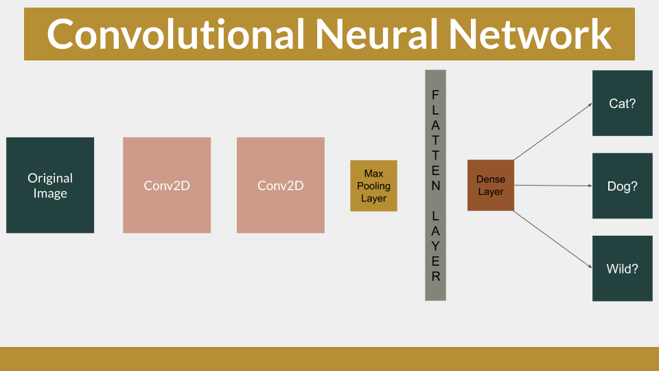
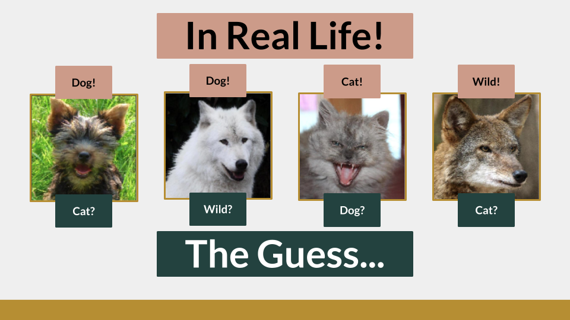
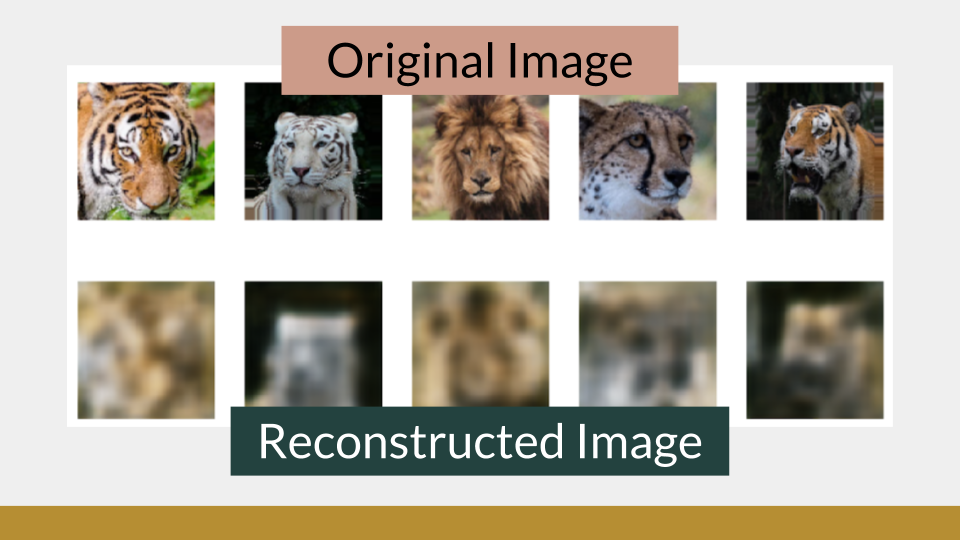
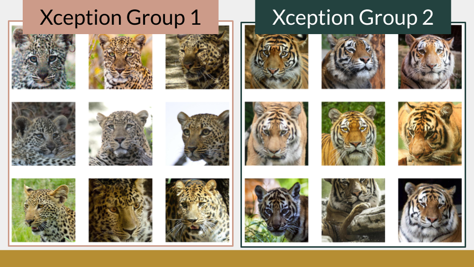
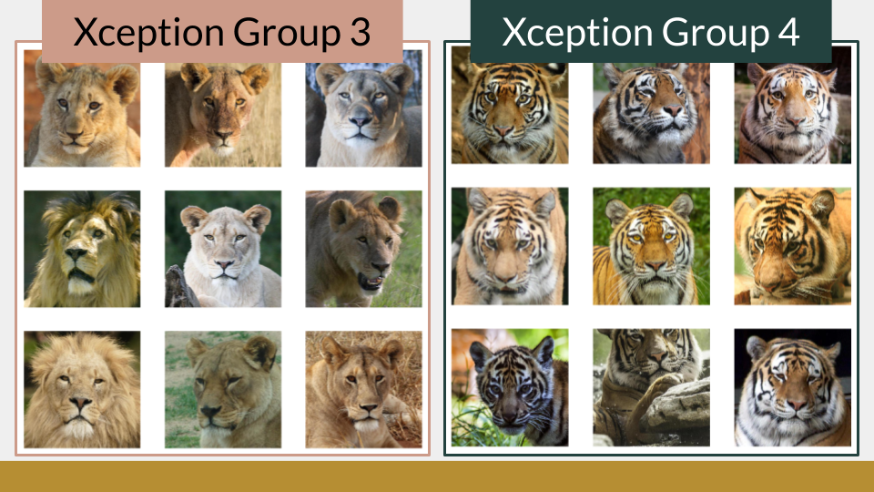

## MVP
Image classification has endless possibilities. I wanted to explore this realm of Data Science using this Kaggle Dataset [Animal Faces](https://www.kaggle.com/andrewmvd/animal-faces) with over 16k images of Cats, Dogs, and Wildlife. My goal was to be able to train a model to correctly classify these images.

## CNN Classification
A convolution neural network was created to classify each image. To process the large number of images I had I utilized an ImageDataGenerator and had it fed into my model in batches of 32. The training images were rescaled, zoomed, flipped, and sheared so that the model could be trained in multiple ways to look at one image.

In a CNN model the image is scanned and searched for patterns which is then passed onto the next layer.

The below figure depicts the architecture and results of my top-performing CNN.

Even with the high performance of my model, there were some times it guessed incorrectly.

I also tested some new images on my model and got some interesting results

## Autoencoder CNN
Once I had a strong model that could classify images into those three categories I wanted to better understand the types of animals I had in my wild folder. I first attempted to understand these images by building an autoencoder CNN. The goal here was to train an autoencoder to encode an image down to a small dimensional space, then rebuild the image back up. My first few autoencoders were reconstructing blurry images.

I removed some max-pooling layers and was able to get much better results in the reconstructed images.

Once my model was trained I rebuild the encoder half of the model to extract the small dimensional space of my images - a flattened array of (1, 32768) features instead of the original image of (512, 512, 3). With this smaller dimensional representation of my image, I attempted KMeans clustering to see which images were grouped together.

The groups were not showing up the way I had expected. 

## Xception CNN
My next and final attempt at clustering my unlabeled images was to use a pre-trained Convolutional Neural Network called Xception. Xception is a deep learning model that has been made available alongside pre-trained weights and has 1000 prediction classes. This model was used to predict the images I have in my Wild folder. Once I made the prediction using the loaded weights of “imagenet” I then used a KMeans cluster of 5 to group my images together. It was successfully able to group my images into 5 classes which I can now see are as follows.

