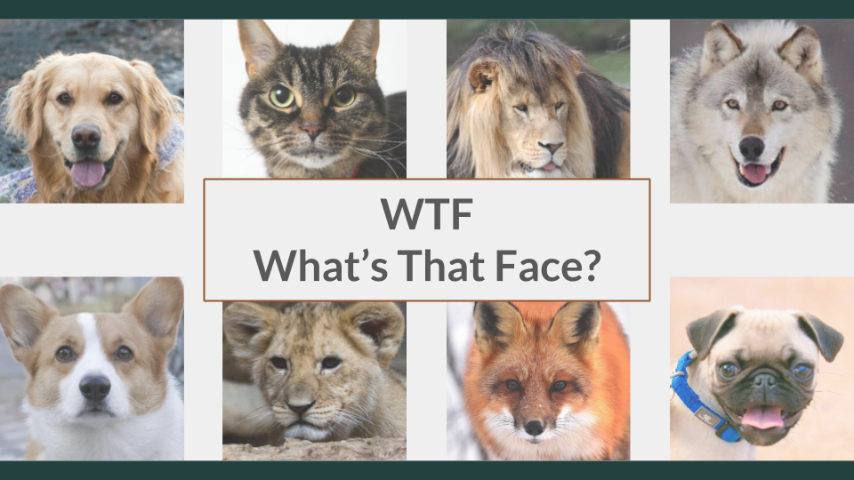
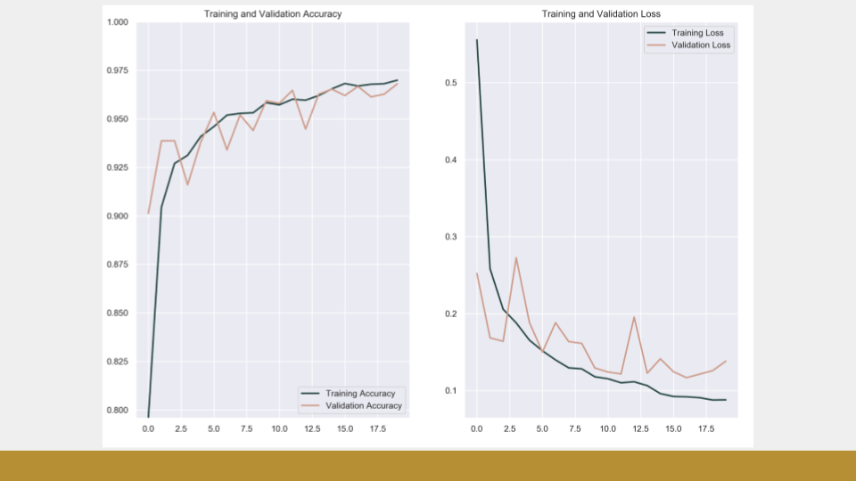
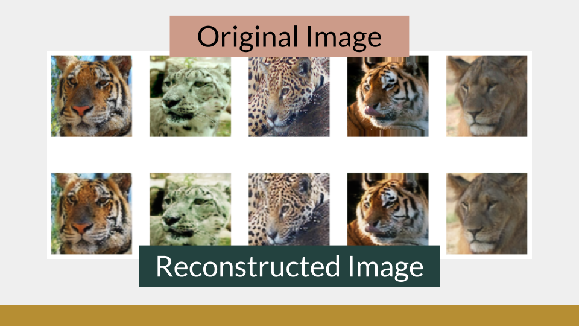
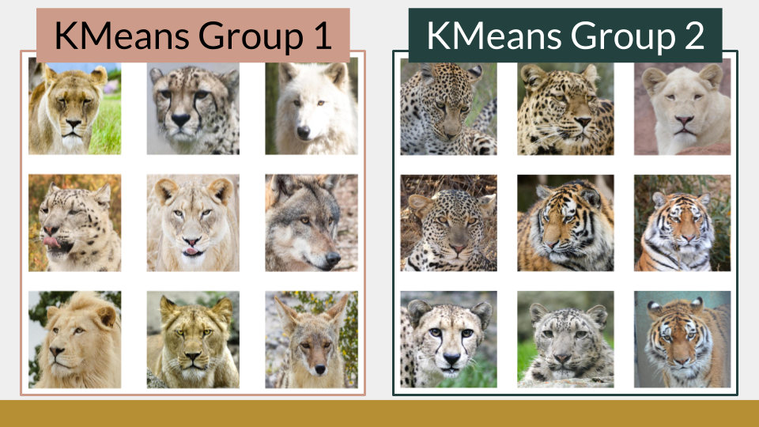
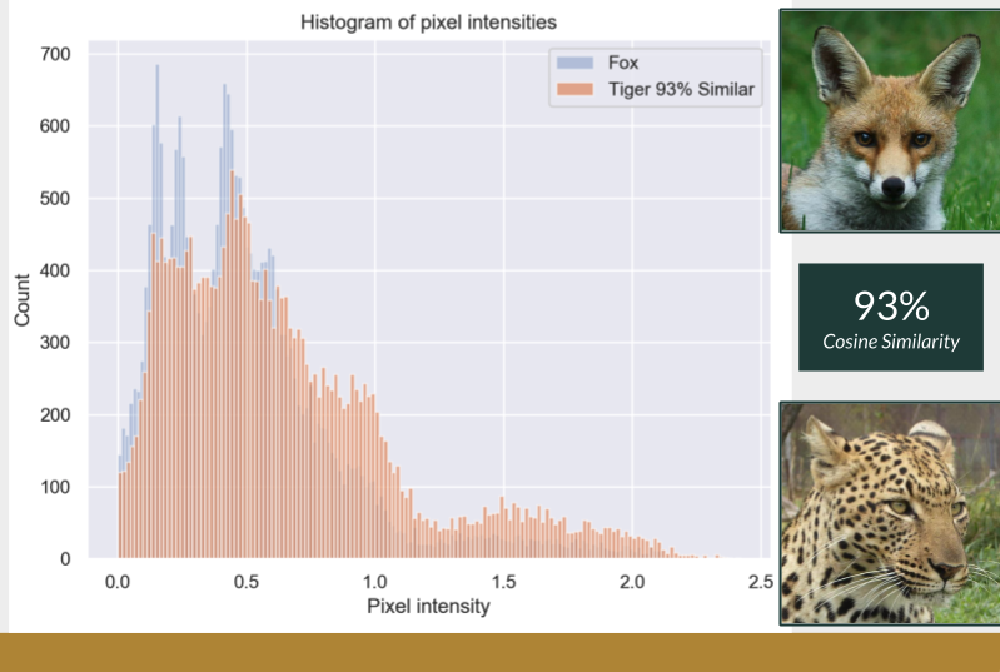
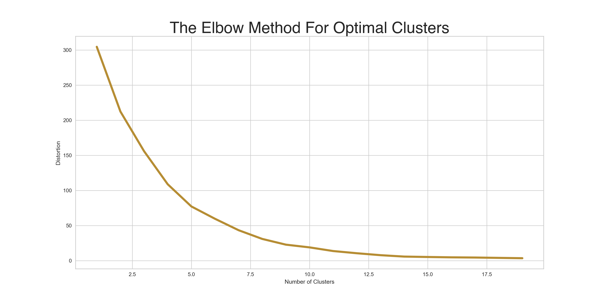
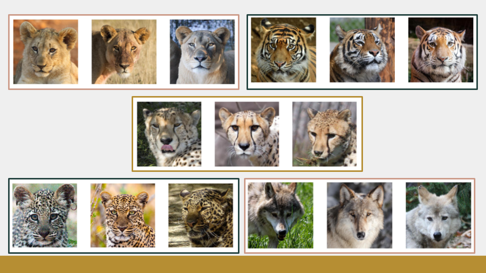

## MVP
Image classification has endless possibilities. I wanted to explore this realm of Data Science using this Kaggle Dataset [Animal Faces](https://www.kaggle.com/andrewmvd/animal-faces) with over 16k images of Cats, Dogs, and Wildlife. My goal was to be able to train a model that will correctly classify these images.

## CNN Classification
A Convolution Neural Network was created to classify each image. To process the large number of images I had I utilized an ImageDataGenerator which will fed my model images in batches of 32. The training images were rescaled, zoomed, flipped, and sheared so that the model could be trained in multiple ways to look at one image. In a CNN model the image is scanned and searched for patterns which is then passed onto the next layer.

The best performing CNN was made with two convolution 2D layers back to back, followed by a max-pooling layer, a flatten layer then a dense layer. Dropout was added in two different locations to regularize my images.

## Autoencoder CNN
Once I had a strong model that could classify images into those three categories I wanted to better understand the types of animals I had in my wild folder using unsupervised learning. I first attempted to understand these images by building an autoencoder CNN. The goal here was to train an autoencoder to encode an image down to a small dimensional space, then rebuild the image back up. My first few autoencoders were reconstructing blurry images. I removed some max-pooling layers and was able to get much better results in the reconstructed images, which tells me that my autoencoder is working efficiently.

Once my model was trained I rebuild the encoder half of the model to extract the latent features of each image. With this smaller dimensional representation of my image, I attempted KMeans clustering, Affinity Propagation, and Mini Batch KMeans to group similar images together. I was expecting to see the same animal in each group, but my encoder seems to be grouping images with a similar color tone. I wanted to dig a little deeper into what was happening at the latent feature stage.

I noticed that when I did a cosine similarity on my images latent features the most similar image was typically the same animal. I also noticed in the example below that this Fox had a 93% cosine similarity to the Cheeta on the right. I took a look at the histogram of those two images latent features pixel intensity and noticed that they are similar. They both have a spike at around 0.25 and 0.5, which makes more sense as to why they are being said to have 93% similarity even though they are not the same animal. This tells me that my clustering on latent features may not be the best approach to identify the animals.

## Xception CNN
My next and final attempt at clustering my unlabeled images was to use a pre-trained Convolutional Neural Network called Xception. Xception is a deep learning model that has been made available alongside pre-trained weights and has 1000 prediction classes. This model can take in an image and will produce a probability that it belongs to each of its 1000 classes. My hope is that this model will be able to predict the animal in my image utilizing the loaded weights of “imagenet.” Once I had the prediction of each image in my wild folder, I then used KMeans cluster to group similar predictions together. Determining the best number of clusters can be tricky, so I plotted the distortion against the number of clusters and looked for the elbow of the plot. 

In the image above there isn’t a very distinct elbow, but there does seem to be a slight bend at 5 clusters. When I look at the 5 groups of predictions from the Xcpetion CNN I can see that it successfully classified my images as Cheeta, Tiger, Lion, Leopard, and the final group seems to be a collection of Foxes and Wolves.

## [Slideshow Presentation](https://docs.google.com/presentation/d/1JvKsp7pDSRXeX4-YDlP0Yqmje-3dnv1IHicosf9CE98/edit?usp=sharing)

## [Kaggle Dataset from Laxel](https://www.kaggle.com/andrewmvd/animal-faces)